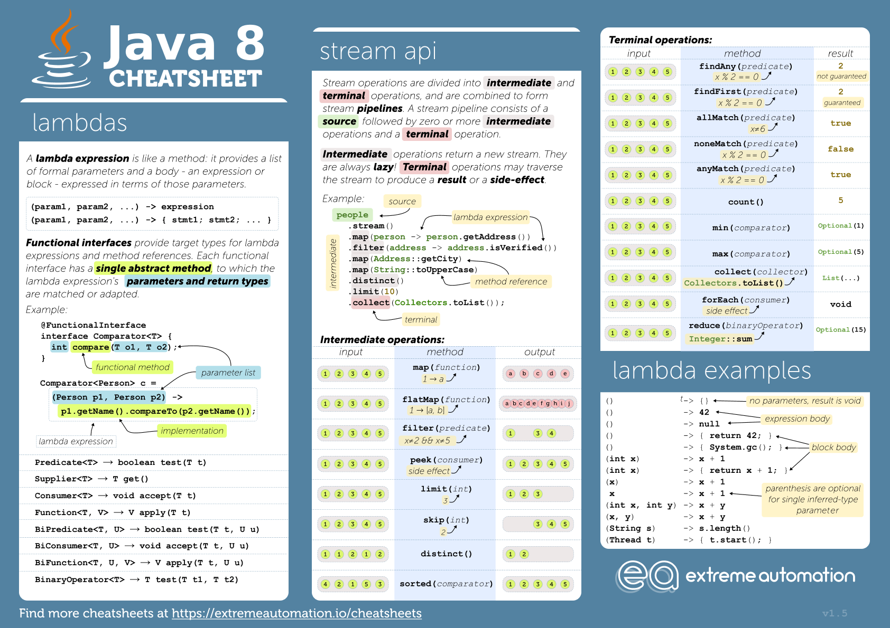

# Java Stream API

## Vytvoření testovacích dat:
- Vytvořte třidu **Person**, která bude mít atributy *name*, *age* a *salary*.
- Vytvořte konstruktor obsahující všechny atributy.
- vytvořte getry a setry pro všechny atributy
- vytvořte *toString()* metodu, která vypíše hodnoty pro každou instanci.
- Vytovořte cca 10 instancí třídy Person a uložte je do kolekce List<Person>.

## Implementujte zadané funkce a následně zkuste vytovřit stejnou funkcionalitu pomocí Java Stream API:
- Vytvorte funkci, která projde seznam všech osob a vypíše osobu s nejnižším platem. *stream().min()*
- Vytovřte funkci, která vrátí seznam osob seřazený abecedně. *stream().sorted()*
- Vytvořte funkci, která vyfilturje a vrátí všechny osoby, které jsou plnoleté. *stream().filter*
- Vytvořte funkci, která vrátí součet platů všech osob. *stream().reduce()*
- Vytvořte funkci, která ze seznamu osob vyfiltruje pouze jejich jména a vrátí List<String> obsahující jména všech osob včetně oslovení před každým jménem. *stream().map()*
- Vytvořte funkci, která seskupí seznam osob podle věku do mapy obsahující věk jako klíč a kolekci osob jako hodnoty (Map<Integer, List<Person>>).  *stream().collect(Collectors.groupingBy)*

